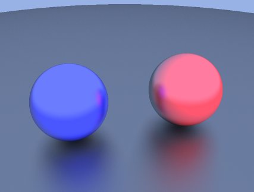
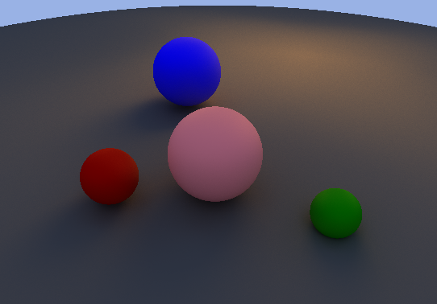

# Ray Tracing Tests

This is inspired by TheCherno series on youtube to render 3D objects entirely with C++. 

## Current results
The following figures are drawed from sratch using the code in this repo. 

An image of 2 rendered 3D balls 

    

An image of 4 rendered 3D balls with path tracing enabled 

    

 

The following is a animation where the camera moves automatically around the scene and dumps the images into a gif.  

This rendering uses 5 bounces and 90fps. It took around 2 hours to render. The gif quality here is not the real one, with this quality it would probably take 15 minutes to render. 

## TODOs
- fix the problem of shapes not showing their colors when the sky is deactivated
- adjust the frame rate of the gif image
- load the gif for when the sky is active
- add more control instead of hardcoded values
- load scene shapes from a config file?
- code cleanup
- code formatting
